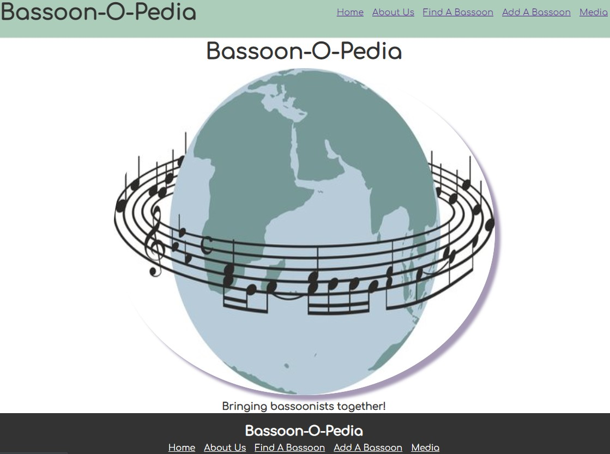

# Bassoon-O-Pedia

<h1> Technologies Used </h1>
<ul>
    <li>Express.js</li>
    <li>Node.js</li>
    <li>MongoDB</li>
    <li>CSS</li>
    <li>HTML</li>
</ul>

<h1> Installation Instructions</h1>

 There aren't any specific instructions in order to view the site. However, If you would like to view the site locally, please fork and clone the repository. You will also need to install Node packages in order to properly view the site.

<h1>User Stories</h1>

As a bassoonists, I want to use Bassoon-O-Pedia to find out more about specific instruments so that I can have a history of either my instrument or an instrument I would like to buy.

As a instrument repair tech, I would use Bassoon-O-Pedia as a way to see past repairs and history of the instrument.

<h1>Unsolved Mysteries</h1>

The aoplication was originally going to have a database of musicians linking to specific instruments that they played. However, I was unable to get the routes to populate correctly and display information from the database. Instead of linking musicians to specific instruments I created a "Media" database to store examples of musicians peforming on different types of instruments. I found this solution to be a bit more interesting because if provide an audible example of the capabilites and qualities of the various model types. <em>I may expand on this section in the future to add a feature to where individuals can submit recording of themselves playing various models of bassoons.</em>

<h1>Wire Frame</h1>

<h1>Route Table<h1>

